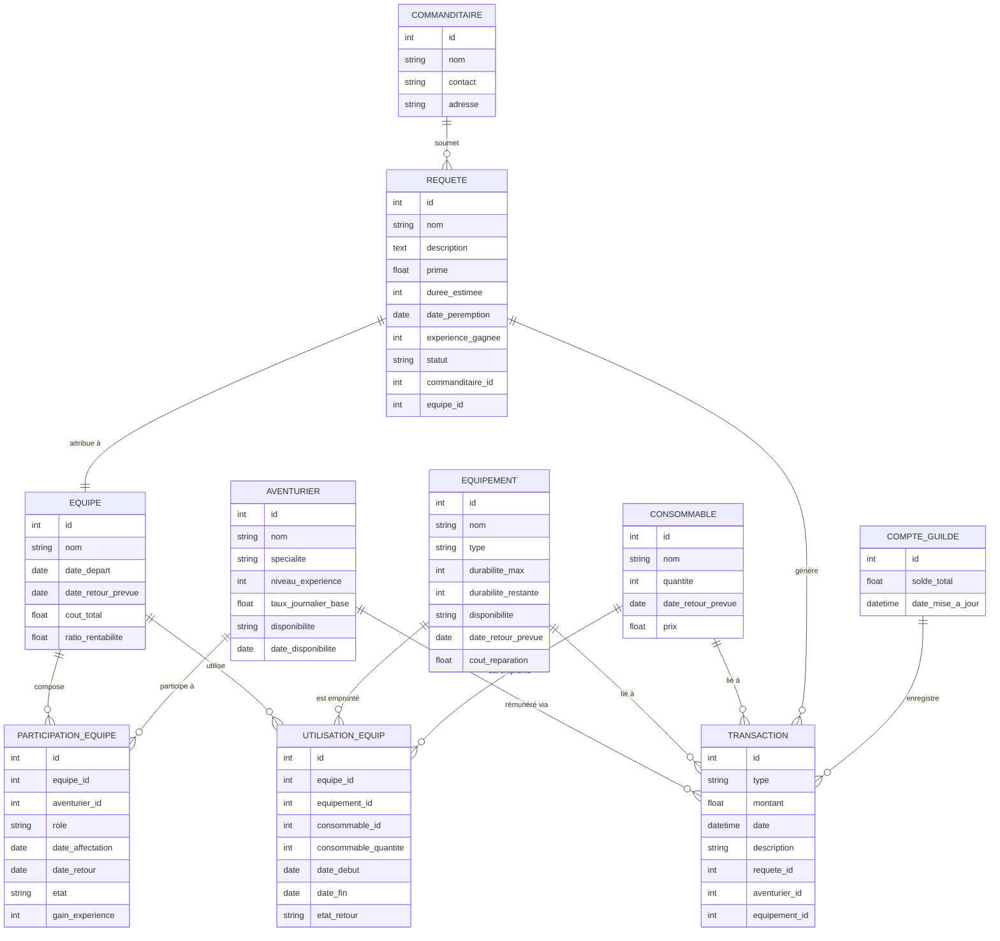

```mermaid
erDiagram
    REQUETE {
        int id
        string nom
        text description
        float prime
        int duree_estimee
        date date_peremption
        int experience_gagnee
        string statut
        int commanditaire_id
        int equipe_id
    }

    COMMANDITAIRE {
        int id
        string nom
        string contact
        string adresse
    }

    EQUIPE {
        int id
        string nom
        date date_depart
        date date_retour_prevue
        float cout_total
        float ratio_rentabilite
    }

    AVENTURIER {
        int id
        string nom
        string specialite
        int niveau_experience
        float taux_journalier_base
        string disponibilite
        date date_disponibilite
    }

    PARTICIPATION_EQUIPE {
        int id
        int equipe_id
        int aventurier_id
        string role
        date date_affectation
        date date_retour
        string etat
        int gain_experience
    }

    EQUIPEMENT {
        int id
        string nom
        string type
        int durabilite_max
        int durabilite_restante
        string disponibilite
        date date_retour_prevue
        float cout_reparation
    }
     
    CONSOMMABLE {
        int id
        string nom
        int quantite
        date date_retour_prevue
        float prix
    }

    UTILISATION_EQUIP {
        int id
        int equipe_id
        int equipement_id
        int consommable_id
        int consommable_quantite
        date date_debut
        date date_fin
        string etat_retour
    }

    TRANSACTION {
        int id
        string type
        float montant
        datetime date
        string description
        int requete_id
        int aventurier_id
        int equipement_id
    }

    COMPTE_GUILDE {
        int id
        float solde_total
        datetime date_mise_a_jour
    }

    COMMANDITAIRE ||--o{ REQUETE : "soumet"
    REQUETE ||--|| EQUIPE : "attribue à"
    EQUIPE ||--o{ PARTICIPATION_EQUIPE : "compose"
    AVENTURIER ||--o{ PARTICIPATION_EQUIPE : "participe à"
    EQUIPE ||--o{ UTILISATION_EQUIP : "utilise"
    EQUIPEMENT ||--o{ UTILISATION_EQUIP : "est emprunté"
    CONSOMMABLE ||--o{ UTILISATION_EQUIP : "est emprunté"
    AVENTURIER ||--o{ TRANSACTION : "rémunéré via"
    EQUIPEMENT ||--o{ TRANSACTION : "lié à"
    CONSOMMABLE ||--o{ TRANSACTION : "lié à"
    REQUETE ||--o{ TRANSACTION : "génère"
    COMPTE_GUILDE ||--o{ TRANSACTION : "enregistre"
```