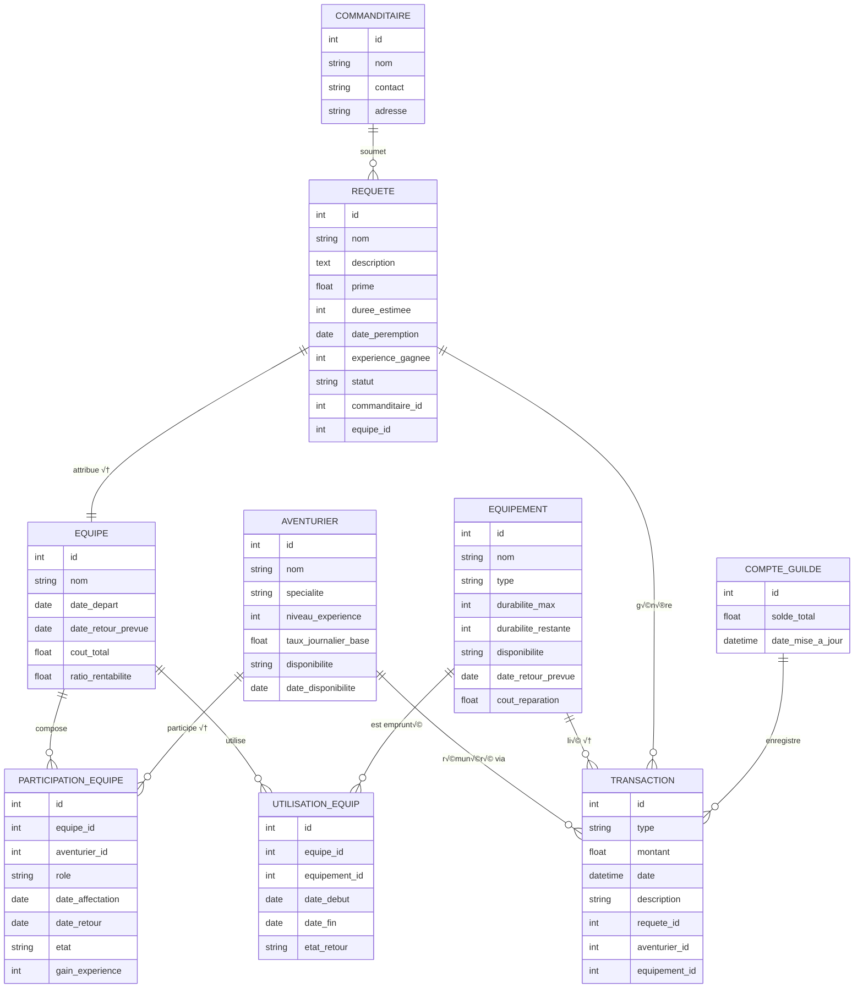

```mermaid
erDiagram
    %% ============================
    %% 🗡️ REQUETES / MISSIONS
    %% ============================
    REQUETE {
        int id
        string nom
        text description
        float prime
        int duree_estimee
        date date_peremption
        int experience_gagnee
        string statut
        int commanditaire_id
        int equipe_id
    }

    %% ============================
    %% 🧑‍💼 COMMANDITAIRE
    %% ============================
    COMMANDITAIRE {
        int id
        string nom
        string contact
        string adresse
    }

    %% ============================
    %% 🧑‍🤝‍🧑 EQUIPE
    %% ============================
    EQUIPE {
        int id
        string nom
        date date_depart
        date date_retour_prevue
        float cout_total
        float ratio_rentabilite
    }

    %% ============================
    %% üßô AVENTURIER
    %% ============================
    AVENTURIER {
        int id
        string nom
        string specialite
        int niveau_experience
        float taux_journalier_base
        string disponibilite
        date date_disponibilite
    }

    %% ============================
    %% üîó PARTICIPATION EQUIPE
    %% ============================
    PARTICIPATION_EQUIPE {
        int id
        int equipe_id
        int aventurier_id
        string role
        date date_affectation
        date date_retour
        string etat
        int gain_experience
    }

    %% ============================
    %% ⚙️ EQUIPEMENT
    %% ============================
    EQUIPEMENT {
        int id
        string nom
        string type
        int durabilite_max
        int durabilite_restante
        string disponibilite
        date date_retour_prevue
        float cout_reparation
    }

    %% ============================
    %% üîó UTILISATION D'EQUIPEMENT
    %% ============================
    UTILISATION_EQUIP {
        int id
        int equipe_id
        int equipement_id
        date date_debut
        date date_fin
        string etat_retour
    }

    %% ============================
    %% üßæ TRANSACTION
    %% ============================
    TRANSACTION {
        int id
        string type
        float montant
        datetime date
        string description
        int requete_id
        int aventurier_id
        int equipement_id
    }

    %% ============================
    %% üí∞ COMPTE GUILDE
    %% ============================
    COMPTE_GUILDE {
        int id
        float solde_total
        datetime date_mise_a_jour
    }

    %% ============================
    %% RELATIONS
    %% ============================
    COMMANDITAIRE ||--o{ REQUETE : "soumet"
    REQUETE ||--|| EQUIPE : "attribue à"
    EQUIPE ||--o{ PARTICIPATION_EQUIPE : "compose"
    AVENTURIER ||--o{ PARTICIPATION_EQUIPE : "participe à"
    EQUIPE ||--o{ UTILISATION_EQUIP : "utilise"
    EQUIPEMENT ||--o{ UTILISATION_EQUIP : "est emprunté"
    AVENTURIER ||--o{ TRANSACTION : "rémunéré via"
    EQUIPEMENT ||--o{ TRANSACTION : "lié à"
    REQUETE ||--o{ TRANSACTION : "génère"
    COMPTE_GUILDE ||--o{ TRANSACTION : "enregistre"
```